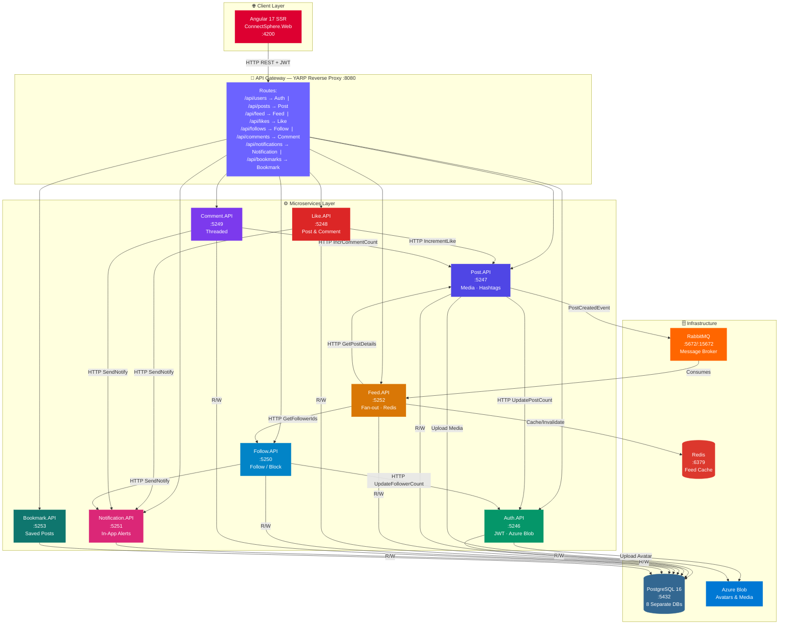
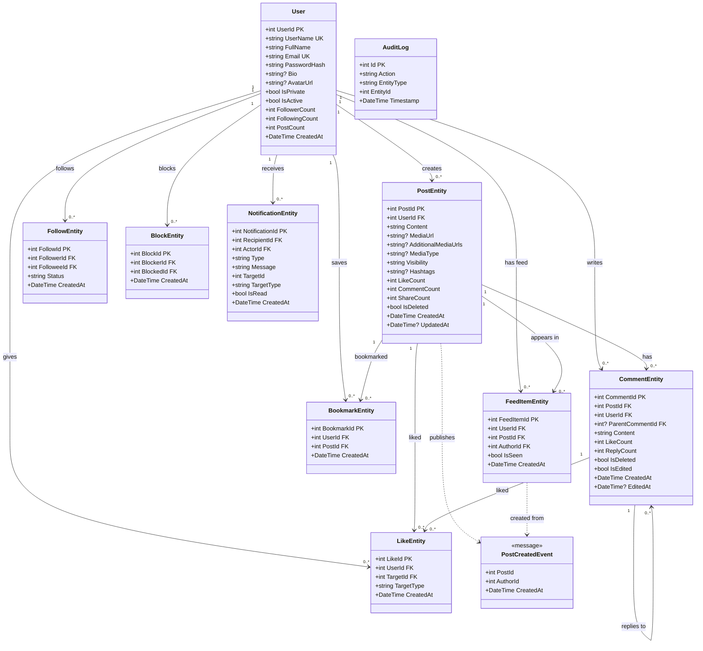
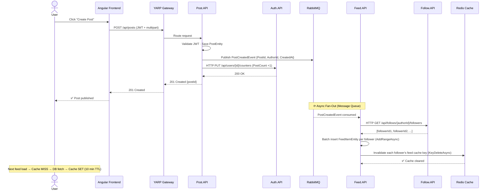
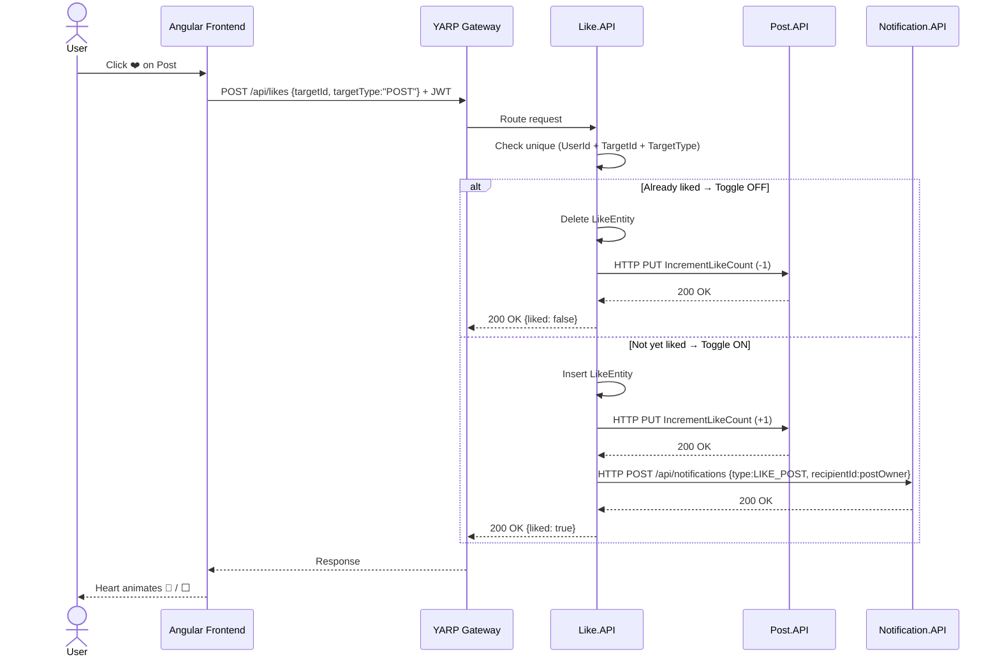
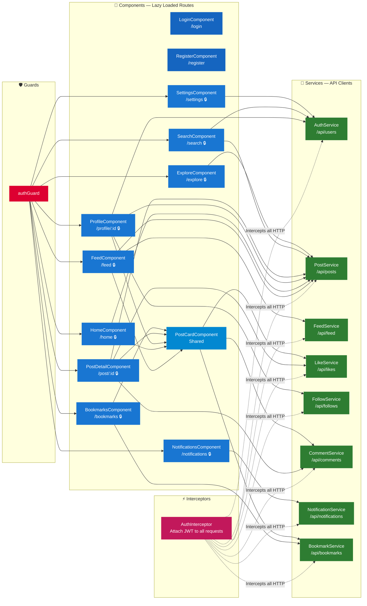
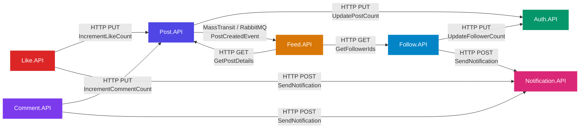

<div align="center">


# ConnectSphere

### A Production-Grade Social Media Platform Built on Microservices

[](https://dotnet.microsoft.com/)
[](https://angular.dev/)
[](https://www.postgresql.org/)
[](https://redis.io/)
[](https://www.rabbitmq.com/)
[](https://www.docker.com/)
[](https://azure.microsoft.com/)
[](LICENSE)

<p>ConnectSphere is a modern, scalable social media platform engineered with a full microservices architecture, event-driven design patterns, and a distributed backend — enabling users to create posts, follow each other, interact with content, and receive real-time notifications at scale.</p>

[Architecture](#-system-architecture) · [Microservices](#-microservices-overview) · [API Docs](#-api-reference) · [Setup](#-getting-started) · [Testing](#-testing)

---

</div>

## 📌 Table of Contents

- [Tech Stack](#-tech-stack)
- [Architecture Overview](#-system-architecture)
- [UML Diagrams](#-uml-diagrams)
  - [System Architecture](#1-system-architecture-diagram)
  - [Entity Class Diagram](#2-entity-class-diagram)
  - [Post Creation Sequence](#3-post-creation--fan-out-flow)
  - [Like Flow Sequence](#4-like-a-post-flow)
  - [Angular Component Diagram](#5-angular-frontend-component-diagram)
  - [Inter-Service Communication](#6-inter-service-communication-map)
- [Microservices Overview](#-microservices-overview)
- [Core Features](#-core-features)
- [Database Schema](#-database-schema)
- [API Reference](#-api-reference)
- [Infrastructure](#-infrastructure)
- [Design Patterns](#-key-design-patterns)
- [Getting Started](#-getting-started)
- [Testing](#-testing)
- [Roadmap](#-roadmap)

---

## 🛠 Tech Stack

| Layer | Technology | Purpose |
|-------|------------|---------|
| **Backend** | ASP.NET Core 8 Web API | 8 independent microservices |
| **Frontend** | Angular 17 (SSR) | Single-page application *(separate repo)* |
| **Database** | PostgreSQL 16 | Per-service isolated databases (DB-per-service) |
| **ORM** | Entity Framework Core | Code-first migrations & data access |
| **Cache** | Redis | Feed caching — Cache-Aside pattern, 10-min TTL |
| **Message Broker** | RabbitMQ + MassTransit | Async event-driven communication |
| **Media Storage** | Azure Blob Storage | Posts media & user avatars |
| **Auth** | JWT (HS256) | Stateless authentication, 7-day expiry |
| **Gateway** | YARP Reverse Proxy | Single entry point, routing & JWT validation |
| **Resilience** | Polly | Exponential backoff retry on inter-service HTTP |
| **Logging** | Serilog + Seq | Structured distributed logging |
| **Testing** | xUnit | Unit & integration tests |
| **Containerization** | Docker & Docker Compose | Full local orchestration |
| **Deployment** | Render.com | Cloud production environment |

---

## 🏗 System Architecture

ConnectSphere follows a **Microservices Architecture** with these core principles:

| Pattern | Applied Where |
|---------|--------------|
| ✅ **Microservices** | 8 independently deployable services |
| ✅ **Event-Driven Architecture** | Async messaging via RabbitMQ + MassTransit |
| ✅ **Fan-Out on Write** | Post creation pre-computes all follower feeds |
| ✅ **Cache-Aside** | Redis feeds with TTL-based invalidation |
| ✅ **API Gateway** | Single YARP entry point for all clients |
| ✅ **Repository + Service Layer** | Clean separation in every microservice |
| ✅ **Resilience (Polly)** | Exponential backoff on all outbound HTTP |
| ✅ **Soft Delete** | Data preserved with `IsDeleted` flag |
| ✅ **DB-Per-Service** | Strict data isolation across all 8 services |
| ✅ **DTO Pattern** | Separate request/response models from entities |

---

## 📐 UML Diagrams

### 1. System Architecture Diagram

> Full deployment view — Client → API Gateway → Microservices → Infrastructure



---

### 2. Entity Class Diagram

> Domain model — all entities, fields, types, and cross-service relationships



---

### 3. Post Creation — Fan-Out Flow

> Sequence diagram — how a post propagates to all followers' feeds asynchronously



---

### 4. Like a Post Flow

> Sequence diagram — toggle like with unique-constraint check and notification dispatch



---

### 5. Angular Frontend Component Diagram

> Guards, interceptors, services, and all lazy-loaded route components



---

### 6. Inter-Service Communication Map

> All synchronous HTTP calls and async RabbitMQ events between services



**Synchronous (HTTP + Polly Retry):**
```
Like.API     → Post.API         (update like count)
Like.API     → Notification.API (send like notification)
Comment.API  → Post.API         (update comment count)
Comment.API  → Notification.API (send comment notification)
Follow.API   → Auth.API         (update follower/following counters)
Follow.API   → Notification.API (send follow notification)
Post.API     → Auth.API         (update post count)
Feed.API     → Follow.API       (get follower IDs for fan-out)
Feed.API     → Post.API         (get post details)
```

**Asynchronous (RabbitMQ + MassTransit):**
```
Post.API  →  [PostCreatedEvent]  →  Feed.API
```

**Polly Retry Policy — Exponential Backoff:**
```
Attempt 1 → wait 2s
Attempt 2 → wait 4s
Attempt 3 → wait 8s
Max 3 retries on 5xx / network errors
```

---

## 📦 Microservices Overview

| Service | Port | Responsibility |
|---------|------|----------------|
| **Auth.API** | 5246 | User registration, login, JWT generation, profile, avatar upload |
| **Post.API** | 5247 | Post CRUD, multi-image upload to Azure Blob, hashtags, visibility |
| **Feed.API** | 5252 | Personalized feed, Redis cache, fan-out via RabbitMQ |
| **Like.API** | 5248 | Like/unlike toggle for posts & comments |
| **Comment.API** | 5249 | Threaded comments & replies |
| **Follow.API** | 5250 | Follow/unfollow, pending requests, block/unblock, suggestions |
| **Notification.API** | 5251 | In-app notifications, unread count |
| **Bookmark.API** | 5253 | Save/unsave posts |
| **Gateway** | 8080 | YARP reverse proxy — routes all incoming client requests |

---

## 🎯 Core Features

<details>
<summary><strong>👤 User & Auth</strong></summary>

- Register with username, email, and password
- Login with JWT token (7-day expiry)
- Profile management — bio, full name
- Avatar upload to Azure Blob Storage
- Public / Private account toggle
- Password change & account deactivation (soft delete)
- Denormalized follower/following/post counters

</details>

<details>
<summary><strong>📝 Posts</strong></summary>

- Create posts with text, hashtags, and visibility (`PUBLIC` / `FOLLOWERS` / `PRIVATE`)
- Multi-image upload with carousel support
- Edit & soft-delete posts
- Trending algorithm: `LikeCount × 3 + CommentCount × 2 + ShareCount`
- Search by keyword or hashtag
- Full pagination support

</details>

<details>
<summary><strong>📰 Feed</strong></summary>

- Personalized feed — posts from followed users only
- Fan-out on write — feed pre-computed async via RabbitMQ
- Redis caching with 10-minute TTL
- Unseen posts banner & mark-as-seen
- Infinite scroll / load more

</details>

<details>
<summary><strong>❤️ Likes · 💬 Comments · 👥 Follow · 🔔 Notifications · 🔖 Bookmarks</strong></summary>

**Likes:** Toggle like/unlike on posts and comments, like count tracking, view who liked

**Comments:** Top-level comments, threaded replies, edit & delete, like comments

**Follow:** Follow public (instant) or private (pending approval) accounts, accept/reject requests, mutual followers, follow suggestions, block/unblock

**Notifications:** Alerts for likes, comments, follow requests, accepted follows — with unread count, mark-as-read, and delete

**Bookmarks:** Save/unsave posts, view all bookmarked posts

</details>

---

## 🗄 Database Schema

Each microservice owns its own isolated PostgreSQL database — no shared DB, no cross-service joins.

| Service | Database | Key Tables | Indices |
|---------|----------|-----------|---------|
| **Auth.API** | `ConnectSphere_Auth` | `Users`, `AuditLogs` | `UserName` (UK), `Email` (UK) |
| **Post.API** | `ConnectSphere_Post` | `Posts`, `AuditLogs` | `UserId + CreatedAt` |
| **Comment.API** | `ConnectSphere_Comment` | `Comments` | `PostId + ParentCommentId` |
| **Like.API** | `ConnectSphere_Like` | `Likes` | `UserId + TargetId + TargetType` (UK) |
| **Follow.API** | `ConnectSphere_Follow` | `Follows`, `Blocks` | `FollowerId + FolloweeId` (UK) |
| **Feed.API** | `ConnectSphere_Feed` | `FeedItems` | `UserId + CreatedAt` |
| **Notification.API** | `ConnectSphere_Notification` | `Notifications` | `RecipientId + IsRead` |
| **Bookmark.API** | `ConnectSphere_Bookmark` | `Bookmarks` | `UserId + PostId` (UK) |

---

## 🌐 API Reference

<details>
<summary><strong>🔑 Auth Endpoints — <code>/api/users</code></strong></summary>

| Method | Endpoint | Auth | Description |
|--------|----------|:----:|-------------|
| `POST` | `/api/users/register` | ❌ | Register new user |
| `POST` | `/api/users/login` | ❌ | Login, returns JWT |
| `GET` | `/api/users/{id}` | ❌ | Get user profile |
| `GET` | `/api/users/byUsername/{name}` | ❌ | Find by username |
| `GET` | `/api/users/search?q=` | ❌ | Search users |
| `PUT` | `/api/users/{id}/profile` | ✅ | Update profile |
| `PUT` | `/api/users/{id}/password` | ✅ | Change password |
| `PUT` | `/api/users/{id}/avatar` | ✅ | Upload avatar |
| `PUT` | `/api/users/{id}/togglePrivacy` | ✅ | Toggle public/private |
| `DELETE` | `/api/users/{id}` | ✅ | Deactivate account |

</details>

<details>
<summary><strong>📝 Post Endpoints — <code>/api/posts</code></strong></summary>

| Method | Endpoint | Auth | Description |
|--------|----------|:----:|-------------|
| `POST` | `/api/posts` | ✅ | Create post |
| `POST` | `/api/posts/upload` | ✅ | Upload media to Azure Blob |
| `GET` | `/api/posts/{id}` | ❌ | Get post by ID |
| `GET` | `/api/posts/user/{userId}` | ❌ | Get user's posts |
| `GET` | `/api/posts/public` | ❌ | Get public posts |
| `GET` | `/api/posts/trending` | ❌ | Get trending posts |
| `GET` | `/api/posts/search?q=` | ❌ | Search posts |
| `GET` | `/api/posts/hashtag/{tag}` | ❌ | Posts by hashtag |
| `PUT` | `/api/posts/{id}` | ✅ | Edit post |
| `DELETE` | `/api/posts/{id}` | ✅ | Delete post |

</details>

<details>
<summary><strong>📰 Feed · ❤️ Like · 💬 Comment · 👥 Follow · 🔔 Notification Endpoints</strong></summary>

**Feed — `/api/feed`**

| Method | Endpoint | Auth | Description |
|--------|----------|:----:|-------------|
| `GET` | `/api/feed/{userId}` | ✅ | Get paginated feed |
| `GET` | `/api/feed/{userId}/unseen` | ✅ | Get unseen feed items |
| `GET` | `/api/feed/{userId}/unseenCount` | ✅ | Get unseen count |
| `PUT` | `/api/feed/{userId}/markSeen` | ✅ | Mark feed as seen |

**Likes — `/api/likes`**

| Method | Endpoint | Auth | Description |
|--------|----------|:----:|-------------|
| `POST` | `/api/likes/toggle` | ✅ | Toggle like/unlike |
| `GET` | `/api/likes/hasLiked/{userId}/{targetId}/{type}` | ✅ | Check if liked |
| `GET` | `/api/likes/count/{targetId}/{type}` | ❌ | Get like count |

**Comments — `/api/comments`**

| Method | Endpoint | Auth | Description |
|--------|----------|:----:|-------------|
| `POST` | `/api/comments` | ✅ | Add comment or reply |
| `GET` | `/api/comments/post/{postId}/topLevel` | ❌ | Top-level comments |
| `GET` | `/api/comments/replies/{commentId}` | ❌ | Get replies |
| `PUT` | `/api/comments/{id}` | ✅ | Edit comment |
| `DELETE` | `/api/comments/{id}` | ✅ | Delete comment |

**Follow — `/api/follows`**

| Method | Endpoint | Auth | Description |
|--------|----------|:----:|-------------|
| `POST` | `/api/follows` | ✅ | Follow a user |
| `DELETE` | `/api/follows/{followeeId}` | ✅ | Unfollow |
| `PUT` | `/api/follows/{followId}/accept` | ✅ | Accept follow request |
| `PUT` | `/api/follows/{followId}/reject` | ✅ | Reject follow request |
| `GET` | `/api/follows/{userId}/followers` | ✅ | Get followers |
| `GET` | `/api/follows/{userId}/following` | ✅ | Get following |
| `GET` | `/api/follows/{userId}/pending` | ✅ | Pending requests |
| `GET` | `/api/follows/suggestions` | ✅ | Follow suggestions |
| `POST` | `/api/follows/block/{blockedId}` | ✅ | Block user |
| `DELETE` | `/api/follows/block/{blockedId}` | ✅ | Unblock user |

**Notifications — `/api/notifications`**

| Method | Endpoint | Auth | Description |
|--------|----------|:----:|-------------|
| `GET` | `/api/notifications/{userId}` | ✅ | All notifications |
| `GET` | `/api/notifications/{userId}/unreadCount` | ✅ | Unread count |
| `PUT` | `/api/notifications/{id}/read` | ✅ | Mark as read |
| `PUT` | `/api/notifications/{userId}/readAll` | ✅ | Mark all read |
| `DELETE` | `/api/notifications/{id}` | ✅ | Delete notification |

</details>

---

## 🔧 Infrastructure

### Redis — Feed Cache

- **Pattern:** Cache-Aside — fetch from DB → store in Redis; subsequent reads hit cache
- **Key format:** `feed:{userId}` (e.g. `feed:42`)
- **TTL:** 10-minute auto-expiry
- **Invalidation:** On new post, all N follower caches deleted via batch `KeyDeleteAsync`

### RabbitMQ — Event Queue

- **Abstraction:** MassTransit over RabbitMQ
- **Publisher:** `Post.API` → `PostCreatedEvent`
- **Consumer:** `Feed.API` consumes from `feed-post-created` queue
- **Pattern:** 1 event triggers N FeedItem inserts in a single `AddRangeAsync` batch

### Azure Blob Storage — Media

- Media stored in `posts` container, avatars in `avatars` container
- GUID-based filenames for collision safety
- DB stores only the blob URL — not the file
- 5 MB file size limit enforced at the API level

### Docker Service Ports

| Service | Container Port | Host Port |
|---------|:--------------:|:---------:|
| PostgreSQL | 5432 | 5432 |
| Redis | 6379 | 6379 |
| RabbitMQ | 5672 | 5672 |
| RabbitMQ Management UI | 15672 | 15672 |
| Auth.API | 5246 | 5246 |
| Post.API | 5247 | 5247 |
| Like.API | 5248 | 5248 |
| Comment.API | 5249 | 5249 |
| Follow.API | 5250 | 5250 |
| Notification.API | 5251 | 5251 |
| Feed.API | 5252 | 5252 |
| Bookmark.API | 5253 | 5253 |
| Gateway | 8080 | 8080 |

---

## 📊 Key Design Patterns

| Pattern | Applied Where |
|---------|--------------|
| Repository + Service Layer | All microservices |
| Dependency Injection | All services via ASP.NET Core DI |
| Fan-Out on Write | `Post.API → RabbitMQ → Feed.API` |
| Cache-Aside | `Feed.API` Redis cache layer |
| Exponential Backoff (Polly) | All inter-service HTTP clients |
| Choreography-Based Saga | `LikeService`, `FollowService` (multi-step with rollback) |
| Soft Delete | `Posts`, `Users` |
| DTO Pattern | Separate request/response DTOs from entities |
| Event-Driven Messaging | `PostCreatedEvent` via MassTransit |
| YARP Reverse Proxy | Gateway routing & JWT validation |

---

## 🔐 Security

- **JWT HS256** — Token signed with shared secret, 7-day expiry
- **BCrypt** — Password hashing via ASP.NET Identity
- **Claim-based Authorization** — `[Authorize]` on all protected endpoints
- **Soft Delete** — User data preserved on account deactivation
- **Input Validation** — DTOs annotated with `[Required]`, `[MaxLength]`
- **EF Core Parameterized Queries** — Full SQL injection protection

---

## ⚡ Performance Optimizations

- **Redis Cache** — Feed served in milliseconds on cache hit; DB only on miss
- **Fan-Out on Write** — Feed pre-computed async; read is O(1) from cache
- **Batch Inserts** — `AddRangeAsync` for all fan-out feed items
- **Batch Cache Deletes** — `KeyDeleteAsync(keys[])` for Redis invalidation
- **`ExecuteUpdateAsync`** — Atomic counter updates without loading full entity
- **Denormalized Counters** — `FollowerCount`, `LikeCount` stored directly on entity
- **Pagination** — All list endpoints support `page` + `pageSize`

---

## 📂 Project Structure

```
ConnectSphere/
│
├── Auth.API/
│   ├── Controllers/        UserController.cs
│   ├── Entities/           User.cs, AuditLog.cs
│   ├── DTOs/               RegisterDto, LoginDto, UserResponseDto
│   ├── Services/           UserService.cs
│   ├── Repositories/       UserRepository.cs
│   ├── Data/               AuthDbContext.cs
│   └── Program.cs
│
├── Post.API/
│   ├── Controllers/        PostController.cs
│   ├── Entities/           PostEntity.cs
│   ├── Services/           PostService.cs, MediaService.cs
│   ├── HttpClients/        AuthServiceClient.cs
│   ├── Events/             PostCreatedEvent.cs
│   └── Program.cs
│
├── Feed.API/
│   ├── Controllers/        FeedController.cs
│   ├── Consumers/          PostCreatedConsumer.cs
│   ├── Cache/              FeedCacheService.cs
│   ├── HttpClients/        PostServiceClient.cs, FollowServiceClient.cs
│   └── Program.cs
│
├── Like.API/               LikeController, LikeService, HttpClients
├── Comment.API/            CommentController, CommentService
├── Follow.API/             FollowController, FollowService, BlockEntity
├── Notification.API/       NotificationController, NotificationService
├── Bookmark.API/           BookmarkController, BookmarkEntity
│
├── Gateway/
│   ├── Program.cs
│   └── appsettings.json    (YARP route configuration)
│
├── ConnectSphere.Tests/
│   └── Tests/
│       ├── AuthTests.cs
│       ├── PostTests.cs
│       ├── LikeTests.cs
│       ├── CommentTests.cs
│       ├── FollowTests.cs
│       └── EndToEndTests.cs
│
└── docker-compose.yml
```

> **Frontend (Angular 17)** lives in a separate repository. See the frontend README for setup.

---

## 🚀 Getting Started

### Prerequisites

- [.NET 8 SDK](https://dotnet.microsoft.com/download)
- [Docker & Docker Compose](https://www.docker.com/)
- [Node.js 20+](https://nodejs.org/)
- Azure Storage Account or [Azurite](https://learn.microsoft.com/en-us/azure/storage/common/storage-use-azurite) (local emulator)

### Option 1 — Docker Compose (Recommended)

```bash
# Clone the repository
git clone https://github.com/yourusername/ConnectSphere.git
cd ConnectSphere

# Start all services (PostgreSQL, Redis, RabbitMQ + all APIs)
docker-compose up --build

# Gateway available at:
# http://localhost:8080
```

### Option 2 — Manual Setup

```bash
# Start each service in a separate terminal
dotnet run --project Auth.API
dotnet run --project Post.API
dotnet run --project Feed.API
dotnet run --project Like.API
dotnet run --project Comment.API
dotnet run --project Follow.API
dotnet run --project Notification.API
dotnet run --project Bookmark.API
dotnet run --project Gateway
```

### Environment Variables

Each service requires an `appsettings.json` (or environment variables in Docker):

```json
{
  "ConnectionStrings": {
    "Default": "Host=localhost;Port=5432;Database=ConnectSphere_Auth;Username=postgres;Password=postgres"
  },
  "Jwt": {
    "Key": "YourSuperSecretKey32CharsMinimum!",
    "Issuer": "ConnectSphere",
    "Audience": "ConnectSphereUsers"
  },
  "RabbitMQ": {
    "Host": "localhost",
    "Username": "guest",
    "Password": "guest"
  },
  "Redis": {
    "ConnectionString": "localhost:6379,password=redis123"
  },
  "Azure": {
    "BlobConnectionString": "DefaultEndpointsProtocol=https;...",
    "PostContainer": "posts",
    "AvatarContainer": "avatars"
  }
}
```

---

## 🧪 Testing

```bash
# Run all tests
cd ConnectSphere.Tests
dotnet test

# Run with code coverage report
dotnet test --collect:"XPlat Code Coverage"

# Run a specific test class
dotnet test --filter "FullyQualifiedName~AuthTests"
```

| Test File | Coverage Area |
|-----------|---------------|
| `AuthTests.cs` | Register, login, JWT validation |
| `PostTests.cs` | Post CRUD, media upload, visibility |
| `LikeTests.cs` | Toggle like, count, duplicate prevention |
| `CommentTests.cs` | Comments, replies, threading |
| `FollowTests.cs` | Follow, pending, accept, block |
| `EndToEndTests.cs` | Full user journey across services |

---

## 🗺 Roadmap

### ✅ Phase 1 — Completed
- User auth, profiles, JWT
- Post creation with multi-image media
- Personalized feed with Redis + RabbitMQ fan-out
- Like, Comment, Follow, Notification, Bookmark services
- Angular 17 frontend (separate repo)
- Docker Compose orchestration
- Render.com production deployment

### 🔄 Phase 2 — Planned
- [ ] Real-time notifications via SignalR
- [ ] Direct messaging
- [ ] Stories / Reels
- [ ] Advanced analytics dashboard
- [ ] Mobile app (React Native)

---

## 📚 Resources

- [ASP.NET Core Docs](https://docs.microsoft.com/aspnet/core)
- [MassTransit Docs](https://masstransit.io/)
- [Angular 17 Docs](https://angular.dev/)
- [YARP Docs](https://microsoft.github.io/reverse-proxy/)
- [Polly Docs](https://www.thepollyproject.org/)
- [Redis Docs](https://redis.io/docs/)

---

<div align="center">

Made with ❤️ · ConnectSphere — Microservices Social Platform

</div>